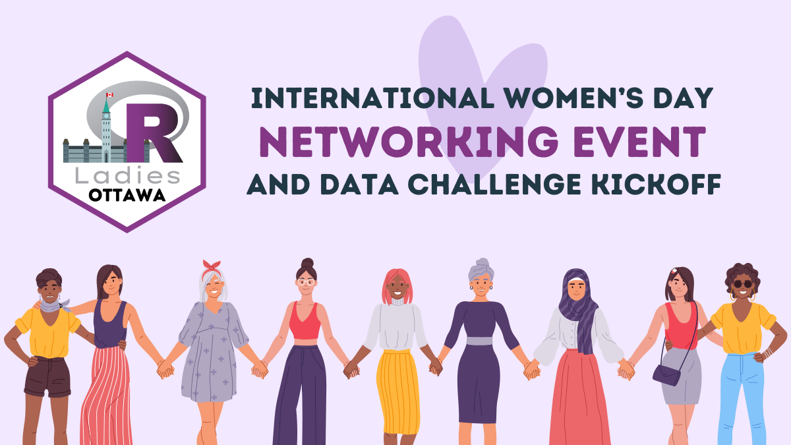
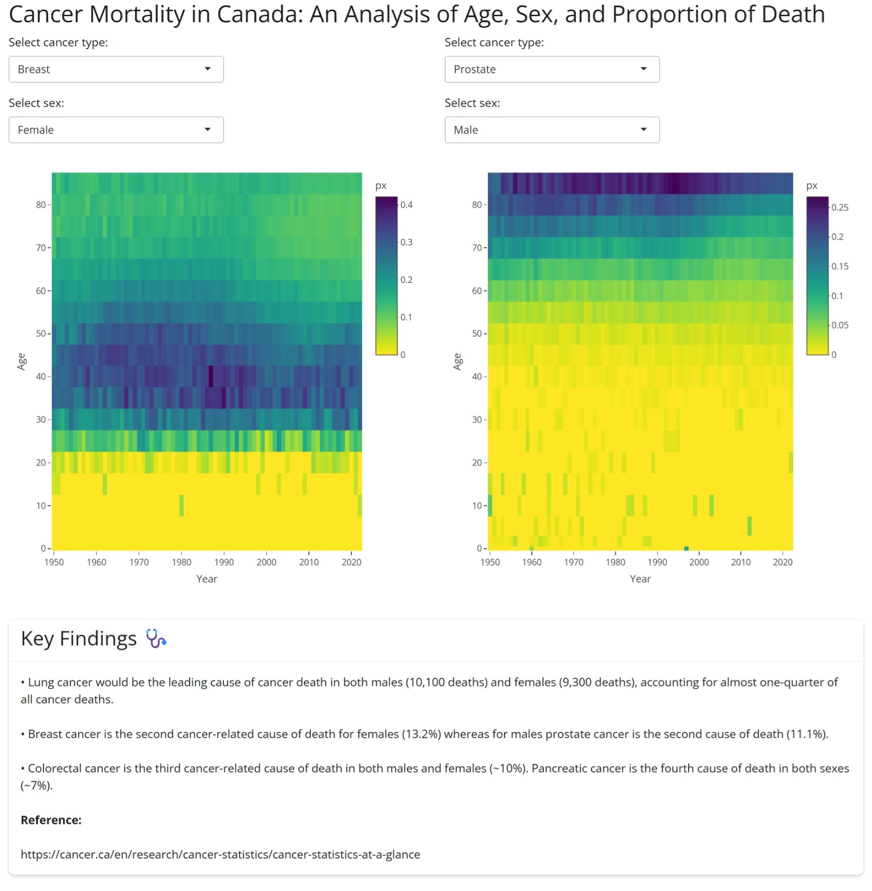

R-Ladies Ottawa is hosting another data challenge to celebrate International Women's Day 2026!

{width=1200}

The International Women's Day 2026 theme is ['Give To Gain'](https://www.internationalwomensday.com/Theme).

::: {.callout-tip}
## Check out last year's submissions!

See the 2025 submissions and prompt [here](https://rladies-ottawa.github.io/events/2025/iwd.html#submissions).
:::

You can find out MeetUp event for our data challenge launch [here](https://www.meetup.com/rladies-ottawa/events/313489908/).

## The Challenge

R‑Ladies Ottawa is excited to host our fourth annual data challenge in celebration of International Women's Day. This year, we invite you to explore **openly available data connected to your community**. That could be Ottawa, Gatineau, another part of the National Capital Region, or any place in the world that feels meaningful to you. As a starting point, we encourage you to browse datasets available through [Open Ottawa](https://open.ottawa.ca/search).

For example, if you participated in [last year's challenge](../2025/iwd.qmd) and created a traditional plot of some sort, this year try creating a visualization using a table, dashboard or another-outside-the-box presentation tool.

::: {.callout-tip appearance="simple"}

For more inspo, be sure to check out our March 2025 event [Coding for a Cause](https://www.meetup.com/rladies-ottawa/events/306232274) with Claudie Larouche!

:::

## Guidelines

Although this challenge is hosted by *R-Ladies* Ottawa, you don't have to use R to participate. You could use R, Python, a combination of the two, or anything you're comfortable with! 

No previous programming experience is required! If you're interested in participating, but aren't sure where to start, check out the recordings from our [Introduction to R workshops](https://rladies-ottawa.gitub.io/events/2024/intro_to_r.html) that we hosted in early 2024. The workshops will give you a solid foundation in data analysis and data visualization using R.

You can participate individually, or in teams of up to 5 people!

## How to submit an entry

We're launching a month-long data challenge starting **March 3, 2026** and you'll have until ~~April 3rd, 2026~~ **April 17th, 2026** to submit your entry. Your submission can be in any form you like -- it can be a Quarto document, an image, a link to a webpage, or a link to a video, for example.

::: {.callout-note}

## Deadline extension

The submission deadline for this year's data challenge has been extended to **April 17th, 2026.**

:::

There are two options for submitting an entry: 

* **Option 1 (preferred option):** If you have experience with GitHub and Quarto, you can create a pull request on [this repository](https://github.com/RLadies-Ottawa/rladies-ottawa.github.io) and add your submission to the ["Submissions"](iwd.qmd#submissions) part of this page.
* **Option 2:** If you don't have experience with GitHub, you can email ottawa@rladies.org a link to your submission materials and we will add the link to the ["Submissions"](iwd.qmd#submissions) part of this page.

## Co-working & networking opportunity

{width=1200}

We're kicking this data challenge off with a co-working party on **March 9th, 2026** where you can network, ask questions or get some ideas for your submission! You can find out more about this event [here](https://www.meetup.com/rladies-ottawa/events/313489942/?eventOrigin=your_events&utm_medium=referral&utm_campaign=event_card_savedevents_share_modal&utm_source=link&utm_version=v2&member_id=381181171).

## Showcasing your analysis

On **Tuesday, April 28th, 2026 from 6pm-8pm**, R-Ladies Ottawa will host [a hybrid event](https://www.meetup.com/rladies-ottawa/events/313489859/?eventOrigin=your_events&utm_medium=referral&utm_campaign=event_card_savedevents_share_modal&utm_source=link&utm_version=v2&member_id=381181171) where participants can showcase their work. This is a great way to learn from one another and to connect with other like-minded individuals!

## Submissions

Submissions from this year's data challenge will be posted below. Submissions from the previous year can be found [here](../2025/iwd.qmd).

### Camy Kam's submission

How are Ottawa/Gatineau residents feeling about their financial situation? Do they find it difficult to meet their household needs? [This Python project](https://github.com/CamyKam/Financial-Security-Ottawa) looks at their survey responses from 2021-2024.

### Brittny Vongdara's submission

She's at it again with her [closeread](https://closeread.dev/)--can she be stopped? Join her on her journey of making closeread her new personality with her submission: "Am I being gaslit?; there should be more street lamps all up in here". You can find her submission [here](https://klaxonklaxoff.github.io/gaslight.html).

### Sofia Balaceanu's submission

Sofia took one regression analysis course and now can’t stop thinking about it. This is her process exploring how respiratory outbreaks relate to ED visits, documented in a Quarto report you can view [here](https://topia05.github.io/Respiratory_Illness_Ottawa/).

### Alissa Vaziri's submission

Alissa created an interactive Shiny app that uses the Human Mortality Database to analyze Cancer in Canada.



To run the Shiny app, see the code below and use the [Age-specific death rates data, 1950-2022 (intermediate list)](https://www.mortality.org/Country/HCDCountry?cntr=CAN) from the Human Mortality Database.

<details>

<summary>Expand to see the code</summary>

```R
#### Canadian Cancer Application Using HMD Intermediate Age-specific Death Rates 1950-2022 ####
# libraries
library(readr)
library(tidyverse)
library(ggplot2)
library(shiny)
library(bslib)
library(shinyWidgets)
library(plotly)

can_int_dat_raw <- read_csv("CAN_m_interm_orig.csv",
  col_types = cols(
    country = col_character(),
    year = col_double(),
    sex = col_character(),
    agf = col_double(),
    cause = col_character(),
    m0 = col_character(), m1 = col_character(), m5 = col_character(), m10 = col_character(),
    m15 = col_character(), m20 = col_character(), m25 = col_character(), m30 = col_character(),
    m35 = col_character(), m40 = col_character(), m45 = col_character(), m50 = col_character(),
    m55 = col_character(), m60 = col_character(), m65 = col_character(), m70 = col_character(),
    m75 = col_character(), m80 = col_character(), m85p = col_character(), m85 = col_character(),
    m90p = col_character(), m90 = col_character(), m95p = col_character(), m95 = col_character(),
    m100p = col_character()
  )
)

# add more rows with pivot longer to remove the raw age groups
can_int_dat <- can_int_dat_raw %>%
  pivot_longer(
    cols = starts_with("m"),
    names_to = "age",
    values_to = "deaths"
  ) %>%
  filter(!age %in% c("m85", "m90", "m95", "m90p", "m95p", "m100p"))

can_int_dat <- can_int_dat %>%
  mutate(
    age_group = case_when(
      age == "m0" ~ "<1",
      age == "m1" ~ "1-4",
      age == "m5" ~ "5-9",
      age == "m10" ~ "10-14",
      age == "m15" ~ "15-19",
      age == "m20" ~ "20-24",
      age == "m25" ~ "25-29",
      age == "m30" ~ "30-34",
      age == "m35" ~ "35-39",
      age == "m40" ~ "40-44",
      age == "m45" ~ "45-49",
      age == "m50" ~ "50-54",
      age == "m55" ~ "55-59",
      age == "m60" ~ "60-64",
      age == "m65" ~ "65-69",
      age == "m70" ~ "70-74",
      age == "m75" ~ "75-79",
      age == "m80" ~ "80-84",
      age == "m85p" ~ "85-100",
      TRUE ~ NA_character_
    ),
    age_start = case_when(
      age == "m0" ~ 0,
      age == "m85p" ~ 85,
      TRUE ~ as.numeric(stringr::str_extract(age, "\\d+"))
    ),
    age_width = case_when(
      age == "m0" ~ 1,
      age == "m1" ~ 4,
      age == "m85p" ~ 15,
      TRUE ~ 5
    ),
    deaths_numeric = as.numeric(deaths)
  ) %>%
  filter(
    !is.na(age_group),
    !cause %in% c(
      "I000", "I001", "I002", "I003", "I004", "I005", "I006",
      "I024", "I025", "I026", "I027", "I028", "I029", "I030", "I031", "I032",
      "I033", "I034", "I035", "I036", "I037", "I038", "I039", "I040", "I041",
      "I042", "I043", "I044", "I045", "I046", "I047", "I048", "I049", "I050",
      "I051", "I052", "I053", "I054", "I055", "I056", "I057", "I058"
    )
  )

# Creating death proportion (px)
can_int_tots <- can_int_dat %>%
  group_by(year, age, sex) %>%
  summarise(total_deaths = sum(deaths_numeric, na.rm = TRUE))

can_int_dat_final <- can_int_dat %>%
  left_join(can_int_tots, by = c("year", "age", "sex")) %>%
  mutate(px = deaths_numeric / total_deaths)

# Labeling causes of death
causes_int <- c(
  "I007" = "Lip, oral cavity and pharynx",
  "I008" = "Esophagus",
  "I009" = "Stomach",
  "I010" = "Colon, rectum and anus ",
  "I011" = "Pancreas",
  "I012" = "Digestive System",
  "I013" = "Larynx, trachea, bronchus and lung ",
  "I014" = "Skin",
  "I015" = "Breast",
  "I016" = "Uterus",
  "I017" = "Ovary",
  "I018" = "Prostate",
  "I019" = "Genital organs",
  "I020" = "Bladder",
  "I021" = "Kidney and urinary organs",
  "I022" = "Leukemia",
  "I023" = "Other/unknown/benign neoplasms"
)
can_int_dat_final <- can_int_dat_final %>%
  mutate(
    causes_int_label = factor(causes_int[cause], levels = unname(causes_int))
  )


#### Shiny App Code ####
ui <-
  fluidPage(
    theme = bs_theme(version = 5),
    titlePanel("Cancer Mortality in Canada: An Analysis of Age, Sex, and Proportion of Death"),
    fluidRow(
      # Left side
      column(
        width = 6,
        selectInput(
          "cause_left", "Select cancer type:",
          choices = setNames(names(causes_int), causes_int),
          selected = "I015"
        ),
        selectInput(
          "sex_left", "Select sex:",
          choices = c("Male" = 1, "Female" = 2, "Both" = 3),
          selected = 2
        ),
        plotlyOutput("heatmap1", height = "600px")
      ),
      # Right side
      column(
        width = 6,
        selectInput(
          "cause_right", "Select cancer type:",
          choices = setNames(names(causes_int), causes_int),
          selected = "I018"
        ),
        selectInput(
          "sex_right", "Select sex:",
          choices = c("Male" = 1, "Female" = 2, "Both" = 3),
          selected = 1
        ),
        plotlyOutput("heatmap2", height = "600px")
      )
    ),
    br(),
    br(),
    fluidRow(
      column(
        width = 12,
        card(
          style = "width: 100%;",
          card_header(h3("Key Findings 🩺")),
          card_body(
            p("• Lung cancer would be the leading cause of cancer death in both males (10,100 deaths) and females (9,300 deaths), accounting for almost one-quarter of all cancer deaths."),
            p("• Breast cancer is the second cancer-related cause of death for females (13.2%) whereas for males prostate cancer is the second cause of death (11.1%)."),
            p("• Colorectal cancer is the third cancer-related cause of death in both males and females (~10%). Pancreatic cancer is the fourth cause of death in both sexes (~7%)."),
            p(strong("Reference:")),
            p("https://cancer.ca/en/research/cancer-statistics/cancer-statistics-at-a-glance")
          )
        )
      )
    )
  )

server <- function(input, output) {
  # left side
  output$heatmap1 <- renderPlotly({
    can_int_sm_left <- can_int_dat_final %>%
      filter(
        cause == input$cause_left,
        sex == input$sex_left
      )
    plot_ly(
      data = can_int_sm_left,
      x = ~year,
      y = ~age_start,
      z = ~px,
      customdata = ~sex,
      type = "heatmap",
      colors = rev(viridisLite::viridis(100)),
      hovertemplate = paste(
        "Year: %{x}<br>",
        "Age: %{y}<br>",
        "Sex: %{customdata}<br>",
        "Px: %{z:.3f}<extra></extra>"
      )
    ) %>%
      layout(
        xaxis = list(title = "Year", tickvals = seq(1950, 2022, 10)),
        yaxis = list(title = "Age", tickvals = seq(0, 99, 10))
      )
  })

  # right side
  output$heatmap2 <- renderPlotly({
    can_int_sm_right <- can_int_dat_final %>%
      filter(
        cause == input$cause_right,
        sex == input$sex_right
      )
    plot_ly(
      data = can_int_sm_right,
      x = ~year,
      y = ~age_start,
      z = ~px,
      customdata = ~sex,
      type = "heatmap",
      colors = rev(viridisLite::viridis(100)),
      hovertemplate = paste(
        "Year: %{x}<br>",
        "Age: %{y}<br>",
        "Sex: %{customdata}<br>",
        "Px: %{z:.3f}<extra></extra>"
      )
    ) %>%
      layout(
        xaxis = list(title = "Year", tickvals = seq(1950, 2022, 10)),
        yaxis = list(title = "Age", tickvals = seq(0, 99, 10))
      )
  })
}
shinyApp(ui = ui, server = server)
```

</details>

### Afnan Madi's submission

Afnan's project focuses on analyzing paramedic service demand in Ottawa (2021–2023), highlighting trends, seasonal patterns, and key insights that can support data-driven decision-making.

The full project, including the dashboard and documentation, can be found at the following GitHub repository:

👉 [https://github.com/Afnanmadi/ottawa-paramedic-demand-analysis](https://github.com/Afnanmadi/ottawa-paramedic-demand-analysis)


### Gretha's submission

Gretha's project is a data analysis of the most requested titles at the Ottawa Public Library (2022–2025), exploring hold counts, demand trends, and reading patterns using Python. You can find the code [here](https://github.com/Gretha-074/Ottawa-Public-Library-Data-Analysis).